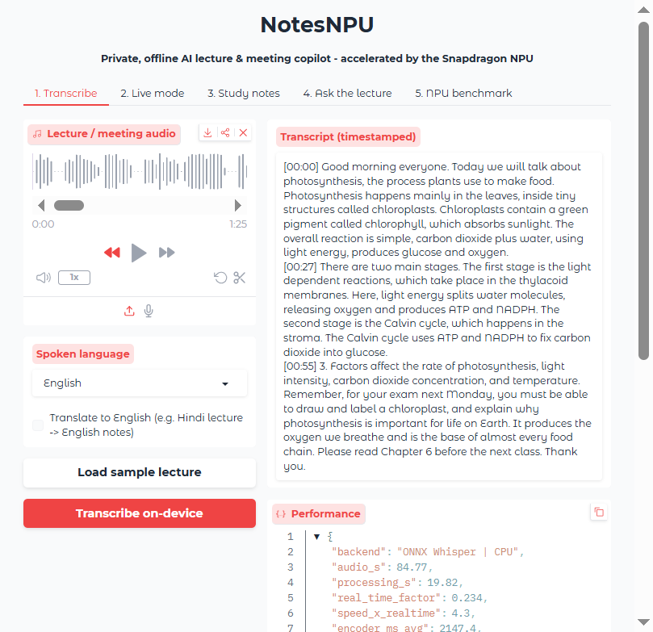

# NotesNPU

**Private, offline AI lecture and meeting copilot, accelerated by the Snapdragon NPU on HP PCs.**

NotesNPU turns any lecture, class or meeting into a timestamped transcript, a summary, structured study notes, flashcards, a quiz and a Q&A chatbot. Everything runs **100% on-device**: no internet, no cloud, and no audio ever leaves your laptop.

Speech-to-text uses **OpenAI Whisper from [Qualcomm AI Hub](https://aihub.qualcomm.com/models/whisper_base)**. It is precompiled for the Snapdragon X-series Hexagon NPU and runs through the **ONNX Runtime QNN Execution Provider**. The study tools use **Microsoft Phi-3.5-mini (INT4)** via **onnxruntime-genai**.

> Built for the *Snapdragon AI Lab Build & Present Challenge* (Qualcomm x HP, India, 2026).



---

## Why

- **Privacy:** classroom and meeting audio is sensitive (student voices, internal discussions). Cloud transcription uploads it to third-party servers. NotesNPU never does.
- **Connectivity:** many Indian campuses, hostels and trains have patchy internet. NotesNPU works in airplane mode.
- **Cost:** no subscription and no per-minute API fees.
- **Battery:** the Hexagon NPU runs Whisper at a fraction of the CPU's power, so you can transcribe a full day of lectures on battery.
- **Multilingual India:** Whisper understands Hindi, Tamil, Telugu, Bengali, Marathi and more, and can *translate to English notes* in the same pass.

## Features

| | |
|---|---|
| **Transcribe** | Upload or record audio, get a timestamped transcript. Long recordings are split at natural pauses. |
| **Live mode** | Speak into the mic; text appears every ~8 s, fully on-device. |
| **Translate** | Hindi (or other Indian language) lecture in, English transcript and notes out. |
| **Summary** | Bullet summary plus a one-line TL;DR. |
| **Structured notes** | Key concepts, detailed notes, and auto-extracted action items and deadlines ("exam next Monday", "read chapter 6"). |
| **Flashcards and quiz** | Revision cards and a 5-question MCQ quiz with answers. |
| **Ask the lecture** | Chat Q&A grounded only in your transcript. |
| **Export** | One-click Markdown export of the whole session. |
| **NPU benchmark** | Built-in NPU vs CPU benchmark (real-time factor, encoder latency, ms/token). |
| **Graceful fallback** | Runs on any Windows PC. It uses the NPU when present, otherwise the CPU, and an extractive engine if no LLM is installed. |

## Architecture

```mermaid
flowchart LR
    Mic[Mic or audio file] --> Chunk[Pause-aware 30 s chunker]
    Chunk --> Mel[Log-mel features]
    Mel --> Enc["Whisper encoder (AI Hub, NPU)"]
    Enc -->|cross-attn KV cache| Dec["Whisper decoder (AI Hub, NPU, KV-cache)"]
    Dec --> Tr[Timestamped transcript]
    Tr --> LLM["Phi-3.5-mini INT4 (onnxruntime-genai)"]
    LLM --> Out[Summary / Notes / Flashcards / Quiz / Q&A]
    Out --> Exp[Markdown export]
```



See [docs/ARCHITECTURE.md](docs/ARCHITECTURE.md) for details: the AI Hub model I/O contract, the decoding loop, NPU session options and fallbacks.

## AI models used

| Task | Model | Source | Runtime / Hardware |
|---|---|---|---|
| Speech-to-text (NPU) | Whisper-Base, precompiled QNN ONNX (FP16), Snapdragon X Elite / X2 Elite | [Qualcomm AI Hub](https://aihub.qualcomm.com/models/whisper_base) (`qai-hub-models` v0.63.0) | ONNX Runtime + `onnxruntime-qnn` (QNN EP, HTP backend), **Hexagon NPU** |
| Speech-to-text (fallback / baseline) | Whisper-Base ONNX (encoder FP32, decoder INT8) | [onnx-community/whisper-base](https://huggingface.co/onnx-community/whisper-base) | ONNX Runtime CPU EP |
| Study assistant | Phi-3.5-mini-instruct, INT4 AWQ | [microsoft/Phi-3.5-mini-instruct-onnx](https://huggingface.co/microsoft/Phi-3.5-mini-instruct-onnx) | onnxruntime-genai |

Measured on a real Snapdragon X Elite NPU (via Qualcomm AI Hub), Whisper-Base takes **45.5 ms per encoder pass** (one pass covers 30 s of audio) and **3.8 ms per decoder token**. That is about **80x faster than real time**, with every op on the NPU. See [Benchmarks](#benchmarks-measured-on-a-real-snapdragon-x-elite-npu).

## Quick start (Snapdragon HP PC, Windows 11 ARM64)

1. Install **native ARM64 Python 3.12**:
   ```powershell
   winget install -e --id Python.Python.3.12 --architecture arm64
   ```
2. Clone and set up (downloads about 3 GB of models once):
   ```powershell
   git clone https://github.com/mdharishsuhaib/NotesNPU.git
   cd NotesNPU
   .\setup.bat          # or: powershell -ExecutionPolicy Bypass -File setup.ps1
   ```
   Use `.\setup.ps1 -NoLLM` for a light install (~300 MB) that uses the extractive study engine.
3. Run:
   ```powershell
   .\run.bat            # opens http://127.0.0.1:7860
   ```
4. Click **Load sample lecture**, then **Transcribe on-device**, then open **Study notes**.

It works on any Windows x64 PC too. The setup script detects the CPU and installs the CPU path instead.

### Command line

```powershell
.\.venv\Scripts\python -m core.asr samples\sample_lecture.wav --backend npu   # or cpu
.\.venv\Scripts\python -m core.asr hindi_class.wav --lang hi --task translate
.\.venv\Scripts\python -m core.bench --llm                                    # NPU vs CPU benchmark
```

## Benchmarks: measured on a real Snapdragon X Elite NPU

The AI Hub Whisper-Base context binaries were run on a **Snapdragon X Elite CRD hosted by Qualcomm AI Hub** using [`scripts/aihub_cloud_npu.py`](scripts/aihub_cloud_npu.py). The raw results are in [`docs/benchmarks/aihub_cloud_npu.json`](docs/benchmarks/aihub_cloud_npu.json), and the jobs are [encoder profile](https://workbench.aihub.qualcomm.com/jobs/jp3zyzwl5/), [decoder profile](https://workbench.aihub.qualcomm.com/jobs/jgoljl4xg/) and [encoder inference on the sample lecture](https://workbench.aihub.qualcomm.com/jobs/jpvljl9j5/). The CPU baseline is NotesNPU's ONNX Whisper-Base profiled on the **same device's Oryon CPU** with [`scripts/aihub_cloud_cpu.py`](scripts/aihub_cloud_cpu.py) ([encoder](https://workbench.aihub.qualcomm.com/jobs/j5m0j0k9g/), [decoder](https://workbench.aihub.qualcomm.com/jobs/jgnzjzqqg/); raw results in [`docs/benchmarks/aihub_cloud_cpu.json`](docs/benchmarks/aihub_cloud_cpu.json)). Processing times for the 85 s lecture = 3 chunks x encoder + 243 tokens x decoder.

Sample: an 85 s lecture (`samples/sample_lecture.wav`), Whisper-Base.

| Device | Backend | Processing time | Speed | Encoder / 30 s | Decoder / token |
|---|---|---|---|---|---|
| Snapdragon X Elite | ONNX Whisper, Oryon CPU | ~6.1 s | ~14x real time | 1286 ms | 9.1 ms |
| **Snapdragon X Elite** | **AI Hub Whisper, Hexagon NPU** | **~1.1 s** | **~80x real time** | **45.5 ms** | **3.8 ms** |
| | *NPU speed-up* | *~5.7x* | | *28.3x* | *2.4x* |

- **100% on the NPU:** all 556 encoder ops and 975 decoder ops run on the Hexagon HTP. Peak memory is 34 MB for the encoder and 60 MB for the decoder.
- **Accuracy:** the NPU's FP16 encoder output matches the FP32 CPU reference (cosine similarity **0.999** on every chunk), and decoding it gives the correct transcript of the whole lecture.
- **Reproduce:** `python scripts/aihub_cloud_npu.py` (needs a free AI Hub token), or `python -m core.bench` on a Snapdragon PC.

## Project layout

```
app.py                  Gradio UI (5 tabs)
core/device.py          NPU detection, QNN plugin EP registration, session factory
core/asr.py             AI Hub Whisper (NPU) + ONNX Whisper (CPU), chunking, language detection
core/audio.py           Audio loading, resampling, pause-aware chunking, mic capture
core/llm.py             Phi-3.5 via onnxruntime-genai, prompts, extractive fallback
core/bench.py           NPU vs CPU benchmark
scripts/                Model download, sample generation
submission/             Pitch deck + project description generators
setup.ps1 / run.ps1     One-click install and launch (.bat wrappers included)
```

## Privacy

- `run.ps1` sets `HF_HUB_OFFLINE=1` and disables Gradio analytics. The server binds to `127.0.0.1` only.
- Audio and transcripts are kept in memory. They are written to `outputs/` only when you click Export.

## Roadmap

- Speaker diarisation ("who said what") for meetings
- Run the LLM on the NPU with AI Hub Llama 3.2 3B / Phi-3.5 QNN context binaries via Genie
- Slide and whiteboard capture with on-device OCR, linked to the transcript timeline
- Semantic search across a semester of lectures (on-device embeddings)
- Packaged MSIX installer for the Microsoft Store

## License

MIT (see [LICENSE](LICENSE)). The models keep their own licenses: Whisper and AI Hub Whisper are Apache-2.0 / AI Hub terms, and Phi-3.5-mini is MIT.
