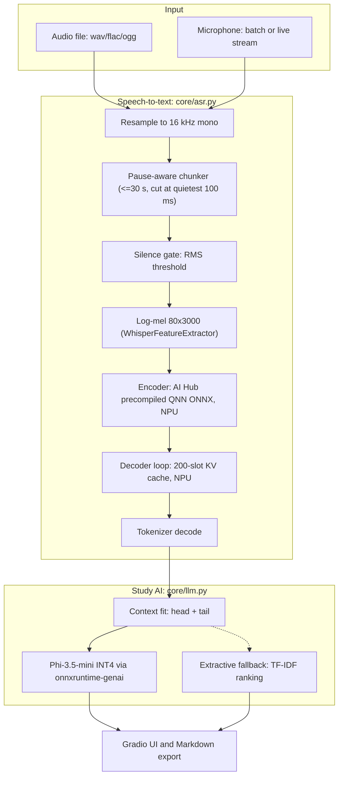

# NotesNPU architecture

## 1. Pipeline

## 2. Running Qualcomm AI Hub Whisper on the NPU

The AI Hub asset `whisper_base-precompiled_qnn_onnx-float-qualcomm_snapdragon_x_elite.zip` contains:

| File | Purpose |
|---|---|
| `encoder.onnx` + `encoder_qairt_context.bin` | EPContext wrapper around a precompiled QNN HTP graph (FP16) |
| `decoder.onnx` + `decoder_qairt_context.bin` | Single-step decoder with a fixed-shape KV cache |
| `metadata.json` | I/O names, shapes and dtypes; QAIRT 2.50, ONNX Runtime 1.27.1, HTP v73 |

Because the graphs are precompiled, session creation skips QNN graph compilation, so start-up is fast and there's no first-run compile.

**Encoder:** takes `input_features [1, 80, 3000] fp16` and returns cross-attention caches directly: `k_cache_cross_i [8, 1, 64, 1500]` and `v_cache_cross_i [8, 1, 1500, 64]` for 6 layers. The decoder never has to recompute cross-attention K/V.

**Decoder (per token):**

| Input | Shape | Notes |
|---|---|---|
| `input_ids` | [1, 1] int32 | current token |
| `position_ids` | [1] int32 | step index |
| `attention_mask` | [1, 1, 1, 200] fp16 | additive mask: -100 everywhere, slot `199 - n` set to 0 at step `n` |
| `k/v_cache_self_i_in` | [8, 1, 64, 199] / [8, 1, 199, 64] | zeros at step 0, then fed back from `*_out` |
| `k/v_cache_cross_i` | from the encoder | constant for the chunk |

Outputs: `logits [1, 51865, 1, 1]` and the updated self-attention caches. The loop in `AIHubWhisper._decode` mirrors the reference `qai_hub_models.models.templates.hf_whisper.app.HfWhisperApp`. It forces the prompt tokens `<|startoftranscript|> <|lang|> <|task|> <|notimestamps|>`, then decodes greedily with timestamp tokens suppressed, stops at `<|endoftext|>`, and has a repetition guard against Whisper's looping failure mode.

All dtypes are read from the session (`get_inputs()`), so the same code handles FP16 (AI Hub) and FP32 exports.

## 3. Execution-provider handling (`core/device.py`)

1. **Plugin QNN EP** (`onnxruntime-qnn >= 2.0`): `ort.register_execution_provider_library("QNNExecutionProvider", qnn.get_library_path())`, select the QNN devices from `ort.get_ep_devices()`, then `SessionOptions.add_provider_for_devices(devices, {"backend_path": qnn.get_qnn_htp_path()})`.
2. **Built-in QNN EP** (`onnxruntime-qnn 1.x`): `providers=[("QNNExecutionProvider", {"backend_path": "QnnHtp.dll", "htp_performance_mode": "burst"}), "CPUExecutionProvider"]`.
3. **CPU fallback:** if neither is available, or the NPU session fails to start (for example a driver mismatch), `Transcriber` transparently switches to the portable ONNX Whisper on the CPU.

Run options use `qnn.perf_mode=burst` and `qnn.rpc_control_latency=100` for the lowest latency during transcription.

## 4. Study AI (`core/llm.py`)

- Phi-3.5-mini-instruct INT4 AWQ (block 128), running on onnxruntime-genai with greedy decoding and a 1.05 repetition penalty.
- Four task prompts (summary, notes, flashcards, quiz) plus grounded Q&A. The system prompt restricts answers to transcript facts.
- Long transcripts: keep the head and tail (topics are introduced early; homework and deadlines come at the end) within about 9k characters.
- **Extractive fallback:** TF-IDF sentence ranking, keyword concepts, a regex action-item detector (exam, deadline, submit, read...) and cloze-style MCQs. It runs instantly on any PC, so the app is always usable.

## 5. Why this is a good fit for Snapdragon

- Whisper's encoder is a dense transformer over 1500 audio frames, which suits the Hexagon HTP's FP16 matrix engines well (AI Hub: 46 ms on X Elite).
- The fixed-shape KV-cache decoder avoids dynamic shapes, which the NPU needs for graph execution.
- With the NPU doing speech, the Oryon CPU cores stay free for the LLM and UI, so live transcription doesn't stutter.
- Low-power inference lets you transcribe all day on battery, which matters for students.
